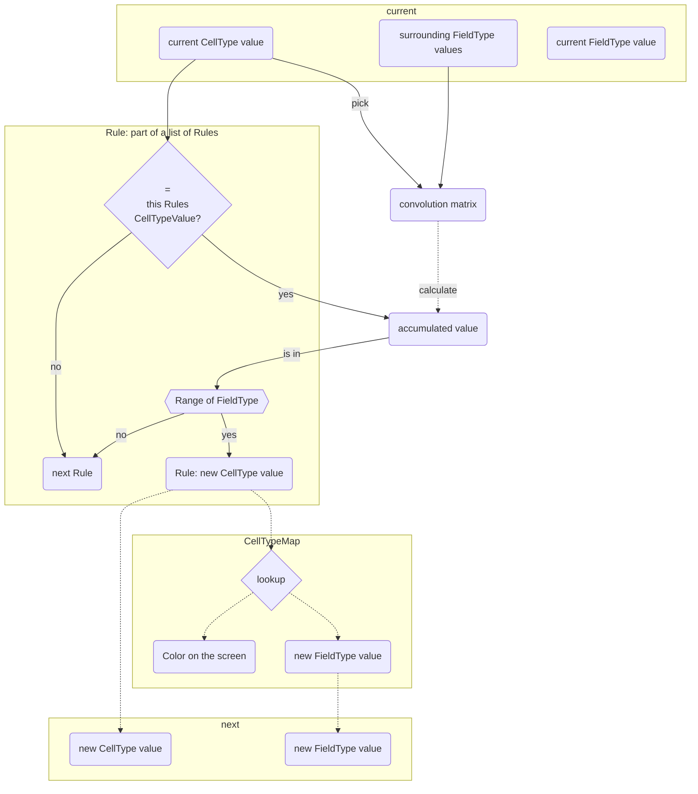

# Rugol

(Ru)st (g)ame (o)f (l)ife
Rugol is a program to simulate and interact with many types of cellular automata.
One goal was to be able to run it in a browser as well as natively.
You can try it out [here](https://sphereflow.github.io/rugol.html)

## How it works

### Matrix

A matrix is a rectangular arrangement of values.  
A value can be of any type.  

### CellType

There are 9 CellTypes: NoCell and CellType A to H.  
Each CellType has its own color, value of type: FieldType and convolution kernel,  
which are all edittable through the ui.  
There is a CellType matrix which is used to display the game state.  

### FieldType

There is a matrix which contains FieldType values.  
These are componentwise multiplied and accumulated.  
The FieldType can be any primitive float or integer type  
and is set at compile time via the FieldType type alias.  

### Convolution kernel

A convolution kernel is a matrix which contains FieldType values.  
Each CellType has its own convolution kernel.  
There is also an option to use a single kernel for all CellType's.
The kernel is used to calculate the accumulated value.  
The following procedure is executed for every cell in the CellType matrix.  
First a kernel is selected according to the CellType.  
Then the kernel is placed like a window over the FieldType matrix.  
The center of the kernel lies over the coordinates of the current cell.  
Then a componentwise multiplication of the kernel and the underlying values  
of the FieldType matrix is executed.  
After that all the multiplied values are added together to obtain an accumulated value.  

### Rules

A rule consists of: an initial CellType, a next CellType and a range of type FieldType.  
If a cell's CellType matches a rule and the accumulated value lies in the rules range,  
then there will occur a transition from: initial CellType to the next CellType.  
the next CellType's value will then be written into the FieldType matrix.  
Rules are stored linearly in a Vec.  
Rules are applied top to bottom.  
Only the first rule that matches is applied.  
